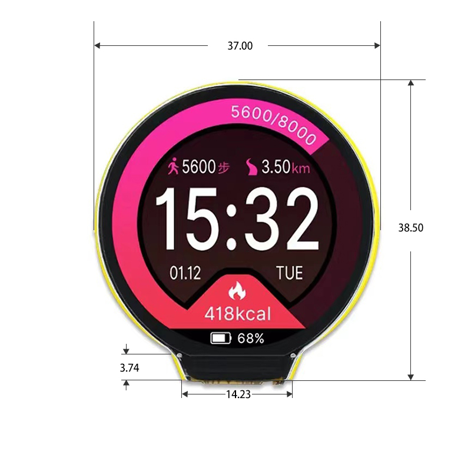

# Car CAN Dashboard

An open-source project to investigate CAN messages and communication for a 2020 Toyota Corolla. This repository provides tools and examples for receiving, decoding, and displaying vehicle data from the CAN bus. The project also experiments with Python and C++ libraries for handling CAN communication and decoding.

Currently using arduino

Fit for the Raspberry Pi. This library is designed to work with standard ELM327 OBD-II adapters.

## 1.28 inch

ESP32 development board, standard 1.28-inch IPS TFT screen and resistor TP, support one-key automatic download, provide LVGL demo and Arduino examples.

### Download link:
[ESP32 module 1.28inch_ESP32-2424S012.zip](http://pan.jczn1688.com/directlink/1/ESP32%20module/1.28inch_ESP32-2424S012.zip)

### Note:
- The power supply voltage should not be lower than 5V.
- It is recommended to use a USB-A to C charger.

[Aliexpress link](https://de.aliexpress.com/item/1005005907739887.html)

### SDK download:
[ESP32 module 1.28inch_ESP32-2424S012.zip](http://pan.jczn1688.com/directlink/1/ESP32%20module/1.28inch_ESP32-2424S012.zip)




---

## Project Goals

1. **CAN Message Examples**  
   - Provide examples for receiving and decoding CAN messages using Python and C++.

2. **Vehicle Information Readout**  
   - Develop a basic dashboard for displaying key vehicle data such as speed, steering angle, and RPM.

3. **Library Exploration**  
   - Experiment with various Python and C++ libraries for CAN communication and decoding.

---

## Future Work

- **Embedded Development**  
   - Explore the potential for using microcontrollers like the ESP32 for standalone CAN devices.  
   - Example hardware for experimentation: [RP2040 MCU with 1.28" Round LCD](https://core-electronics.com.au/rp2040-mcu-based-128inch-round-lcd-onboard-sensors.html).

---

## Features

- Examples of receiving raw CAN messages.
- Decoding CAN messages into human-readable signals.
- Visualization of decoded signals on a simple dashboard.

---

## Getting Started

### Prerequisites

- A compatible CAN adapter (e.g., USB-to-CAN or Bluetooth-based CAN diagnostic device).
- Linux (preferred for SocketCAN support) or Windows.
- Python 3.x and/or a C++ compiler.

### Setup

1. **Clone the repository**:
   ```bash
   git clone https://github.com/yourusername/car-can-dashboard.git
   cd car-can-dashboard
   ```

2. **Install Python dependencies** (if using Python):  

* **PyQt5**: Provides the GUI framework.
* **pyqtgraph**: Handles graph plotting.
* **qt-material**: Adds a modern theme to the PyQt application.
* **python-obd**: Allows interaction with OBD-II adapters to fetch vehicle data.

   ```bash
   pip install -r requirements.txt
   ```
---

## Usage

### Receiving CAN Messages

#### Python Example:
Use `python-can` to receive raw CAN frames.
```bash
python examples/receive_can.py
```

#### C++ Example:
Compile and run the C++ program to read messages.
```bash
mkdir build && cd build
cmake ..
make
./receive_can
```

### Decoding CAN Messages

Use `cantools` to decode raw CAN messages based on a DBC file:
```bash
python examples/decode_can.py --dbc path/to/dbc/file.dbc
```

---

## Libraries Used

- **[python-can](https://python-can.readthedocs.io/)**: For Python-based CAN communication.
- **[cantools](https://github.com/eerimoq/cantools)**: For parsing and decoding DBC files in Python.
- **SocketCAN (Linux)**: For native CAN support in Linux.
- **C++ SocketCAN**: For low-level CAN communication using raw sockets.

---

## Contributing

Contributions are welcome!  
Feel free to open issues or submit pull requests with improvements, features, or bug fixes.

---

## License

This project is licensed under the MIT License. See the [LICENSE](LICENSE) file for details.

---

## Acknowledgments

- Inspired by the need to understand and explore automotive CAN communication.  
- Special thanks to the open-source community for providing incredible tools like `python-can` and `cantools`.

---

This README provides a clear overview of your project and helps others understand its purpose, setup, and future direction.